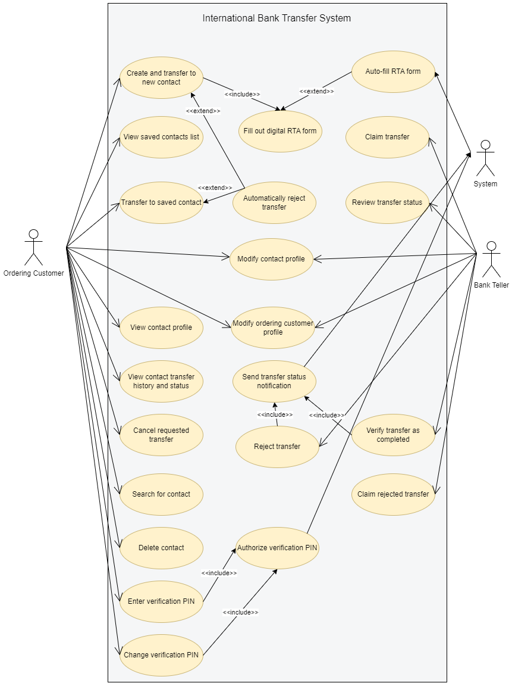
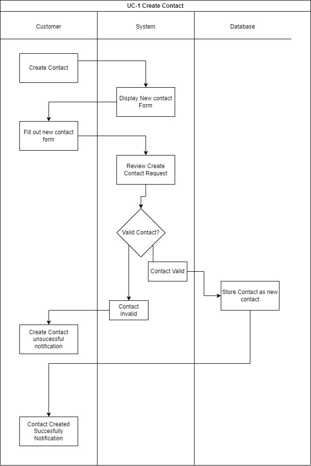

# Requirements Document - Pichincha Bank (January 30, 2024)

## Revision History

| Name | Date | Reason for Changes | Version |
|------|------|--------------------|---------| 
| Cache Money Inc | Jan-30-24 | Initial document creation | 1.0.0 |
| Cache Money Inc | Feb-03-24 | Merging team members independent sections into doc | 1.0.1 |
| Cache Money Inc | Feb-04-24 | Merging team members independent sections into doc | 1.0.2 |
| Cache Money Inc | Feb-04-24 | Formatting changes and document review | 1.1.0 |
| Cache Money Inc | Feb-04-24 | Iteration 1 RD submission | 2.0.0 |  
| Cache Money Inc | Feb-07-24 | Revisions and changes from client review | 2.0.1 |
| Cache Money Inc | Feb-11-24 | Revisions and changes from client review | 2.0.2 |  
| Cache Money Inc | Feb-17-24 | Addition of iteration 2 sections | 2.1.0 |  
| Cache Money Inc | Feb-18-24 | Revisions and changes to iter 2 | 2.1.1 |  
| Cache Money Inc | Feb-18-24 | Iteration 2 RD submission | 3.0.0 |  
| Cache Money Inc | Mar-09-24 | Revisions and changes from iter 2 feedback | 3.0.1 |
| Cache Money Inc | Mar-10-24 | Adding analysis model diagrams and storyboards | 3.1.0 |
| Cache Money Inc | Mar-10-24 | Iteration 3 RD - Final submission | 4.0.0 |

## Table Of Contents  

* [1.0 Overview](#10-overview)  
* [2.0 Business Requirements](#20-business-requirements)  
   * [2.1 Background](#21-background)  
   * [2.2 Business Opportunity](#22-business-opportunity)  
   * [2.3 Business Objectives](#23-business-objectives)  
   * [2.4 Success Metrics](#24-success-metrics)  
   * [2.5 Product Vision Statement](#25-product-vision-statement)  
* [3.0 Scope and Limitations](#30-scope-and-limitations)  
   * [3.1 Major Features](#31-major-features)  
   * [3.2 Project Scope](#32-project-scope)  
   * [3.3 Limitations and Exclusions](#33-limitations-and-exclusions)  
* [4.0 Context Description](#40-context-description)  
   * [4.1 User Classes and Characteristics](#41-user-classes-and-characteristics)  
   * [4.2 Operating Environment](#42-operating-environment)  
   * [4.3 Design and Implementation Constraints](#43-design-and-implmentation-constraints)  
   * [4.4 Assumptions and Dependencies](#44-assumptions-and-dependencies)  
   * [4.5 Glossary of Terms](#45-glossary-of-terms)  
   * [4.6 References](#46-references)
* [5.0 System Features](#50-system-features)
   * [5.1 International Money Transfer Request (Feature)](#1-international-money-transfer-request)
   * [5.2 Manage Contacts (Feature)](#2-manage-contacts)
   * [5.3 Manage Transfer Status (Feature)](#3-manage-transfer-status)
   * [5.4 Customer Profile (Feature)](#4-Customer-profile)
* [6.0 Data Requirements](#60-data-requirements)
   * [6.1 Logical Data Model](#61-logical-data-model)
   * [6.2 Data Dictionary](#62-data-dictionary)
   * [6.3 Reports](#63-reports)
   * [6.4 Data Acquisition, Integrity, Retention, and Disposal](#64-data-acquisition-integrity-retention-and-disposal)
* [7.0 External Interface Requirements](#70-external-interface-requirements)
   * [7.1 User Interfaces](#71-user-interfaces)
   * [7.2 Hardware Interfaces](#72-hardware-interfaces)
   * [7.3 Software Interfaces](#73-software-interfaces)
   * [7.4 Communication Interfaces](#74-communication-interfaces)
* [8.0 Software Quality Attributes](#80-software-quality-attributes)
* [9.0 Analysis Models](#90-analysis-models)
    * [9.1 Use Case Diagram](#91-use-case-diagram)
    * [9.2 Data Flow Diagrams](#92-data-flow-diagrams)
    * [9.3 Storyboards](#93-storyboards)
    * [9.4 Sequence Diagrams](#94-sequence-diagrams)
    * [9.5 Dialog Maps](#95-dialog-maps)
    * [9.6 Swim Lane Diagrams](#96-swim-lane-diagrams)
* [10.0 Appendix](#100-appendix)  
   * [System Prototype](#system-prototype)  

# 1.0 Overview  
The following requirements document contains the complete set of requirements pertaining to the development of a solution for Pichincha Banks inefficient paper method for performing international fund transfers.  

# 2.0 Business Requirements  

## 2.1 Background 
Pichincha Bank is a private bank based in Ecuador with approximately 1.5 million Customers [[1]](https://es.wikipedia.org/wiki/Banco_Pichincha). The Bank offers a variety of online services to its members through its mobile and web banking portals. These services include online investing, bank certificates, credit and debit account management, and domestic money transfers. Pichincha Bank is looking to improve their international money transfer process due to staff productivity and Customer satisfaction concerns through the implementation of a digital system.   

Pichincha Bank’s international money transfer process utilizes a paper Request for Transfer Abroad form (RTA) and requires Tellers to manually input data from the completed RTA form into the digital Society for Worldwide Interbank Financial Telecommunication (SWIFT) Alliance system. The current process is inefficient for both bank Tellers and Customers. The following steps further describe the current process:

   1. An ordering Customer arrives at a Pichincha Bank location and waits for an available Teller  

   2. The Customer completes a paper RTA form with information relating to the transfer source account, beneficiary account, monetary amount, and SWIFT code  

   3. A Teller verifies this information and manually inputs the data into the SWIFT Alliance system  

   4. A Teller initiates a SWIFT transaction  

   5. The beneficiary’s bank receives the transfer and verifies the information  

   6. The funds are deposited into the beneficiary account approximately 7 days after initiation of the SWIFT transaction  

The process outlined above assumes no errors were made by either the Customer completing the RTA form, or the bank Teller inputting the data. If errors occur and are not resolved before initiation of the SWIFT transaction, it takes approximately 3 weeks for the error to be resolved. 

In response to concerns about the efficiency of the current process, Pichincha Bank is seeking to enhance its international fund transfer process. The subsequent segments of Section 2 will further detail Pichincha Bank’s challenges, objectives, and the success metrics of a proposed solution. 
 
## 2.2 Business Opportunity  
The current financial transaction system for international fund tranfers is inefficient and affects both Customers and bank Tellers.  

* Customers often experience lengthy wait times at the bank and spend a significant amount of time filling out the physical forms. Simultaneously, Tellers spend time walking clients through the physical forms and verifying that they contain the correct and appropriate information.
* The long duration of the transaction causes Customer dissatisfaction and frustration. The inefficiency of the international transfer process has a detrimental impact on the organization’s reputation, and profits.
  
Our team proposes the implementation of a digital transaction system. This initiative aims to not only speed up the transaction process but also significantly improve accuracy and productivity. By reducing transaction time and minimizing errors, the new digital process will elevate the overall Customer experience and improve employee productivity.

## 2.3 Business Objectives  
The business objectives of Pichincha Bank are designed to improve the overall process of international transactions. The following are objectives that are designed to help improve Pichincha Bank’s success through the following means: 

* **Improve Staff Productivity by 25% in Six Months:** By eliminating the need for Customers to physically visit the bank to process an international transfer, Teller's can better allocate their time to resolving Customer inquiries that require an in-person visit. 

* **Reduce Wait Times by 30% in Four Months:** Having a digital method of filling out the RTA form reduces the necessity for Customers to meet with a Teller, thus lowering the amount of Customers requiring an in-person visit and reducing the wait time for Customers to meet with a Teller. 
      
* **Increase Customer and Employee Satisfaction by 50% in Eight Months:** Improving the accessibility and clarity of the international transfer system will reduce transaction processing time, and thus reduce complaints and improve employee and Customer satisfaction. 
      
* **Reduce Bank Visits Per Customer to One in a Year :** Introducing a user-friendly interface in the mobile app, coupled with straightforward instructions that provides Customers with information to address inquiries and reduce unnecessary visits.  

## 2.4 Success Metrics  
The following success metrics are indicators that allow Pichincha Bank stakeholders to measure the overall success of the implemented solution: 

* **Increase of International Transfers by 15% Within Six Months:** Through increasing staff productivity by 25%, the amount of international transfers are increased by 15% within the next six months. 
   
* **Reducing international transfer processing time by 30% in Four Months:** By reducing wait times by 30%, processing times of international transfers are reduced by 30% within four months.   
   
* **Increase Customer Base by 20% in Eight Months:** Through increasing Customer and employee satisfaction by 50%, the Customer base of Pichincha Bank can be increased by 20% within eight months.    

## 2.5 **Product Vision Statement**  
The International Bank Transfer System provides Customers the ability to perform international transfers via the existing Pichincha Bank web and mobile applications without the need to meet with a bank employee in person. The system will provide Customers the ability to add and store international contacts to which funds can be transferred, as well as provide a digital interface for completing the RTA form, allowing Customers to submit the required information to complete an international transfer remotely. The functionality of the system also extends to bank employees, providing a review and processing portal for handling international transfer requests created by a Customer. By providing an alternative to in person, paper form international transfers, the International Bank Transfer System aims to direct 80% of the international transfer Customer base to a Pichincha Bank application, thus freeing Teller resources for tasks requiring in person support.

# 3.0 Scope and Limitations  

## 3.1 Major Features  
The implemented system must be an addition to the current bank app which will facilitate international transfers. There is a Customer facing side of the app and a Teller facing side which each require different features.

The major features of the Customer facing side are:  

* **Digital RTA Form:** A digital form which prompts an ordering Customer for the information required to make an international transfer. The digital form will request the same information as the current physical RTA form.
* **Add New International Contact:** Create a new contact will have the ordering Customer fill out the digital RTA form for a new beneficiary and then add the new contact to the their contact list.
* **Auto-Fill Form:** Provide the ordering Customer with the option to save RTA form data the first time they fill it out to be auto-filled for all future uses. Saved and auto filled information will be data specific to the ordering Customer and not the beneficiary.
* **Saved Contacts:** Allow the ordering Customer to view a list of contacts they have previously submitted the RTA form for. Each contact must have a contact page which states whether previous transfers were successfully completed, date of transaction, and transaction amount for that contact.
* **Transfer to Saved Contact:** Ordering Customer is able to make an international transfer to one of the saved contacts without filling out the RTA form again. Transaction specific information including the transfer amount and reason must be collected.
* **International Transfer Verification PIN:** A 4-digit PIN must be entered upon each attempt to submit the RTA form for an international transfer request. The PIN must be changed in the user profile, when the Customer wants to change the PIN.
* **User Profile:** An interface in which the ordering Customer may access the data stored about them for international transfers and make changes to it. The specific items which must be editable within this section are the verification PIN and the [Ordering Customer RTA Form Information](#Ordering_Customer_RTA_Form_Section).
* **Transfer Status Notifications:** After a Teller marks a transfer as either completed or rejected (see employee facing features for details), the ordering Customer will receive a notification (via either email or SMS depending on preferred method selected in user settings). The notification must state success status, and next steps for failed transfers.
* **Help Information:** Help text is displayed containing more information about what is required to be entered in each data entry box on the digital RTA form.
      
The major features for the Teller facing side are:  

* **International Transfer Processing Portal:** An interface in which a bank Teller will view all requested international transfers and the RTA form corresponding to the transfer. The portal must sort all requested transfers into four categories: Unprocessed (new beneficiary), Unprocessed (existing beneficiary), In Process, Completed, and Rejected.
* **Claim a Transfer:** A Teller claims a transfer from the unprocessed transfers to show that they will be verifying the information in the transfer form and entering the information into the SWIFT alliance system to send a transfer. Once a transfer is claimed the software will sort it into the “in process” category.
* **Complete a Transfer:** After an international transfer is successfully deposited to the beneficiary the Teller processing that transfer will manually mark the transfer as complete. The software then sorts the transfer into the “completed” category.
* **Reject Transfer:** If there is an issue with the transfer which prevents it from being deposited the Teller will manually reject the transfer. The software then sorts the transfer into the “rejected” category.
* **Auto-Reject Transfer:** Whenever a new transfer is requested the software will automatically check if there is an insufficient balance in the account for the transfer, then if there is insufficient balance label the transfer as rejected and sort it into “rejected”. If there is sufficient balance the system will sort the transfer into the correct “unprocessed" category.
* **Dealing with Rejected Transfers:** If a Customer contacts the bank to fix a rejected transfer, a Teller will claim the transfer and the system will move it to “in process”.
         
## 3.2 Project Scope  
The project should deliver an addition to the current Pichincha Bank app which facilitates international transfers. Customer and bank Teller interfaces must be created to allow for the various tasks undertaken by different user groups. The purpose of the software is to allow for international transfers to be made digitally, lowering strain on the brick and mortar bank while increasing ease of use for Customers. 

The final product will support the business goals described in Section 2.  

* **Improve Staff Productivity:** The software will improve staff productivity by allowing Customers to make international transfers without direct interaction with staff. The “Help Information” feature will provide additional helpful information to ordering Customers. This will save the Tellers' time to spend on other important tasks.
* **Reduce Wait Times:** The software will eliminate wait times to fill out RTA forms for online international transfers by immediately providing online users with RTA forms. The in person wait time to fill out RTA forms will also be reduced as the majority of ordering Customers will prefer the benefits that filling out the form online provides. 
* **Customer Satisfaction:** The software will contain numerous features designed to improve Customer satisfaction. Ordering Customers will not need to travel to the bank to make international transfers, as the software will allow all necessary tasks to be performed online, saving Customers valuble time and effort. The saved contacts feature the software provides will provide ordering Customers with a more seamless experience when sending money to an international beneficiary repeatedly. Within the new system, Customers will be able to save international beneficiary information. This will reduce the time required to fill out the form and thus, shorten the time until the transaction is complete.
* **Employee Satisfaction:** Employee satisfaction will increase as they will not have to work with paper forms for the majority of international transfers. The employee portal will easily allow for information to be read and added to the SWIFT Alliance app, Tellers will not need to worry about the confusion of misreading customers’ handwriting.    

## 3.3 Limitations and Exclusions  
The Pichincha Bank international transfer system aims to enhance the efficiency and user-friendliness of international transactions through its mobile and web applications. This initiative is driven by the need to improve Customer and staff satisfaction, reduce transaction times, and address the current system's inefficiencies. However, the project's scope is defined by certain limitations and exclusions that are essential to understand for setting realistic expectations and achieving the desired outcomes. Below is an expanded view of the limitations based on the detailed project document and the exclusions that extend beyond the project's scope.

### Limitations  

* **Delayed Interactions with Real-World Bank Tellers:** The project is limited by the inherent delays in interactions with bank Tellers, which can extend the processing time for international transfers. This limitation is a consequence of the current reliance on manual verification and data entry processes.

* **Interactions with the SWIFT System:** The efficiency of international transfers is limited by the interactions with the SWIFT system, which is an external dependency with its own processing times and operational constraints.

* **Integration with Existing Banking Systems:** The project must integrate with Pichincha Bank's current banking systems and protocols, which may limit the flexibility in implementing certain features or require additional time for compatibility adjustments.

* **Technological Constraints:** The project is limited by the current technological infrastructure of Pichincha Bank, including hardware capabilities, software compatibility, and the operational capacity of the mobile and web platforms.

* **Dependency on External Services:** The reliance on third-party services such as SWIFT Alliance and Docusign introduces limitations related to their availability, reliability, and compatibility with the bank's systems.

### Exclusions

* **Legality and Regulatory Compliance:** Issues related to legality and regulatory compliance, while critical to the banking operations, are excluded from the project's direct scope. These areas are assumed to be addressed by other specialized teams within Pichincha Bank, ensuring compliance with relevant laws and regulations without burdening the project team with areas outside their expertise.

* **Customer Education on Financial Regulations:** Educating Customers on the complexities of international financial regulations is outside the scope of this project. While the app aims to simplify the transfer process, the responsibility for understanding the legal implications of international transfers remains with the Customers.

By clearly defining these limitations and exclusions, Pichincha Bank sets a realistic framework for the international transfer project, ensuring that stakeholders have a clear understanding of what the project will deliver and the areas that are beyond its immediate scope. This clarity is essential for managing expectations and focusing efforts on achieving the project's primary objectives of improving Customer satisfaction, and staff productivity within the defined constraints.

# 4.0 Context Description  

## 4.1 User Classes and Characteristics  
The Pichincha Bank international transfer system is designed to cater to a diverse range of users, differentiated by their interaction frequency, technical expertise, security needs, and the specific functionalities they utilize. Given the system's dual focus on facilitating international transfers for both individual Customers and businesses, as well as enabling administrative oversight and management, we have identified two primary user classes: the Customer Class and the Administrative Class. Each of these classes is further subdivided to address distinct user needs and priorities.

### Customer Class  

> #### - Subclass 1: Regular User -
> 
> **Characteristics:** Individuals using the system for personal international money transfers. This group is characterized by a wide range of technical expertise, from novice to advanced users, and includes both infrequent and regular users.
>
> **Privileges:** Regular Users are able to initiate and manage their international transfers, access and fill out the digital RTA Form, save beneficiary details for future transactions, and receive status notifications about their transfers.
>
> **Special Considerations:** While Regular Users have access to the full suite of transfer functionalities, their transactions are processed with standard priority, which may result in slightly longer processing times during peak periods compared to Business Users.

> #### - Subclass 2: Business User -
> 
> **Characteristics:** Organizations or entities that require the system for business-related international transfers. This subclass includes small and medium enterprises, large corporations, and other financial entities. Business Users are expected to have a higher volume of transactions and may have increased familiarity with the international transfer processes.  
>
> **Privileges:** See Regular User priviledges.   
>  
> **Special Considerations:** Business Users may require additional support for batch processing of transactions and might benefit from detailed transaction reporting for accounting purposes.  

### Administrative Class

> #### - Bank Tellers -
>
> **Characteristics:** Bank Tellers are responsible for verifying international transfer requests. This subclass possesses a high level of technical expertise and understanding of banking regulations and the SWIFT System.
>
> **Privileges:** Bank Tellers can access and manage incoming transfer requests, verify transaction details, input information into the SWIFT System, and update the transaction status. They play a critical role in ensuring the accuracy and security of transfers.
>
> **Responsibilities:** Their primary responsibility includes inputting Customer data into the SWIFT system and providing support to Customers as needed.

By distinguishing between these user classes and their respective characteristics, Pichincha Bank can tailor the international transfer system to meet the varied needs of its users effectively, ensuring a seamless and secure experience for both Customers and administrative personnel.

## 4.2 Operating Environment  

The following outlines the operating environment of the system, providing crucial insights into the hardware, software platforms, and applications with which the system must seamlessly integrate and function. Understanding these constraints and the operating environment is paramount for development teams as they navigate the design, development, and deployment phases of the project.

||||
|-|-|-|
|CON~1|Hardware Platform|The operating environment for the system encompasses mobile devices and web browsers. For users accessing the Pichincha Bank mobile app, the platform includes mobile devices. Meanwhile, ordering Customers accessing the application through the website utilize a laptop or desktop computer.|
|CON~2|Operating Environment |The supported operating environments include operating systems iOS and Android. Specifically, the system is designed to function seamlessly on the latest versions of both iOS and Android. Additionally, compatibility is maintained across various browsers such as Chrome, Microsoft Edge, Safari, and others for ordering Customers accessing the application through the website.|
|CON~3|Software Applications|The system is integrated into an environment where it must integrate with the existing Pichincha Bank web and mobile app. The primary application is the Pichincha Bank mobile app, an existing app tailored for banking services. Additionally, the system interacts with the SWIFT Alliance system.|

## 4.3 Design and Implementation Constraints  

Design and implementation constraints delineate the parameters within which the development of the international transfer system for Pichincha Bank must operate. These constraints encompass various facets, ranging from integration with existing systems to multilingual support and security considerations. Understanding these constraints is pivotal for ensuring that the final product aligns with the bank's operational standards and regulatory requirements.

||||
|-|-|-|
|CON~4|Existing System Integration|The designed system should conform and integrate seamlessly with the existing online banking application, as well as integrating with the current technology infrastructure and databases employed by Pichincha Bank. The responsibility for maintaining the app post-delivery will rest with the current app maintainers|
|CON~5|Application Languages|The software is mandated to support both English and Spanish languages. This linguistic flexibility is essential to cater to a diverse user base and enhance accessibility for Customers who communicate in either language.|
|CON~6|Parallel Operations|The system must be capable of executing international transfer transactions concurrently. This constraint emphasizes the need for efficient parallel processing, ensuring that multiple international transfer operations committed within the same time frame can be executed simultaneously.|
|CON~7|Security Considerations|Security is a top priority, requiring robust measures to safeguard user data and financial transactions. The software must implement encryption protocols for secure data transmission, preventing unauthorized access. Additional security features include the introduction of a PIN for completing new forms related to international transfers, with provisions to change the PIN. Moreover, the use of Docusign for filling signatures on forms contributes to the overall security and authentication of transactions.|    

## 4.4 Assumptions and Dependencies   
The successful implementation of this project relies on several critical assumptions and dependencies. The following factors form the foundation upon which the project’s framework is built:  

* **User Authentication:** We assume that the mechanisms for user authentication in Pichincha Bank's current application are robust and secure. This includes the assumption that the current security protocols are sufficient to protect sensitive financial transactions and personal data against potential cyber threats. Any changes or failures in this area could impact user trust and system integrity.
* **Existing Technological Infrastructure:** We rely on the current app and website’s ability to support the addition of new features without compromising performance. This includes assumptions about the scalability of the current system to handle an increase in user traffic and international transfer demands.
* **Third Party Services:** We depend on the stability and reliability of external platforms like SWIFT Alliance for processing transactions and Docusign for digital signatures. Any significant disruptions in these services could impact the functionality and reliability of the international transfer system.
* **Legal Compliance:** We assume that the addition of international transfers to the existing application will comply with current and future international regulations. Changes in banking regulations could require significant adjustments to the project scope or design. 
* **User Adoption:** We assume that users will readily transition to the new online method for international transfers.
     
These assumptions should be regularly reviewed to ensure they remain valid throughout the project’s development.
   
## 4.5 Glossary of Terms  
|Term|Definition|
|----|----------|
|Auto-Reject Transfer|An automatic system function that rejects a transfer if there is an insufficient balance in the ordering Customer's account to cover the transfer amount.|
|Beneficiary|The account or bank receiving money from an international transfer. It is the ultimate destination of the funds sent by the ordering Customer.|
|C.C.|(*Carné de Ciudadanía*) National identity card used in Ecuador, serves as offical proof of identity.|
|C.I.|(*Cédula de Identidad*) National identity card used in Ecuador, serves as offical proof of identity.|
|Claim a Transfer|The action taken by a Teller to indicate they are verifying the information for a transfer and will be processing it through the SWIFT system.|
|Complete a Transfer|The marking of a transfer as finished by a Teller after successfully depositing the funds into the beneficiary account.|
|Contact| Beneficiary which the ordering Customer has previously created an international transfer request for. |
|Customer Facing Side|The part of the app used by ordering Customers to initiate and manage international transfers.|
|Digital Transaction Platform|The proposed solution for improving the international money transfer process, involving a digital feature integrated into Pichincha Bank's existing mobile and web applications to facilitate faster and more accurate transactions.|
|Docusign|A document signing software that you can use to legally—and securely—collect approvals online in minutes.|
|Help Information|Text displayed within the app providing guidance on how to complete the digital RTA form and other related queries.|
|ITR|(*International Transfer Request*) An International Transfer Request made by a Customer.|
|Ordering Customer|The individual or entity initiating an international money transfer. This party is responsible for providing the necessary information and funds for the transfer. Refering to Customer.|
|Pichincha Bank|A private banking institution based in Ecuador, offering a range of services including investments, account management, and money transfers.|
|Reject Transfer|The action taken by a Teller when a transfer cannot be processed due to issues with the information provided, leading to its cancellation.|
|RTA Form|(*Request for Transfer Abroad form*) The request form used by Pichincha Bank to enact a transfer of funds internationally.|
|RUC|(*Registro Único de Contribuyentes*) Unique identification number assigned to individuals and businesses for tax purposes in Ecuador.|
|SWIFT|(*Society for Worldwide Interbank Financial Telecommunication*) A global member-owned cooperative providing secure messaging services and interface software for financial transactions among its members.|
|SWIFT Alliance System|The digital platform used by Pichincha Bank to process international money transfers through the SWIFT network.|
|Teller|A Customer facing bank employee that helps Customer issues and requests in person.|  
|Teller Facing Side|The interface used by bank Tellers to process requested international transfers, including verifying information and entering it into the SWIFT Alliance system.|

## 4.6 References  

#### Web References  

|ID|Reference|
|--|---------|
|[1]|“Banco Pichincha,” Wikipedia, Jan. 28, 2024. https://es.wikipedia.org/wiki/Banco_Pichincha (accessed Feb. 02, 2024).|  

#### Image References  

|ID|Reference|
|--|---------|
|[2]|"Banco Pichincha Mobile App Page," App Advice, n.d. https://appadvice.com/game/app/pichincha-banca-movil/999191728 (accessed Feb. 14, 2024).|  

# 5.0 System Features  

This section of the requirements document outlines the system features of the International Bank Transfer System.    
   
## 1. International Money Transfer Request

#### **Description**
This feature allows a Customer to request an international transfer and a Teller to manage and process international transfer requests. A Customer shall be able to specify an amount of money to transfer to a contact with an Account Verification PIN. A Teller shall be able to claim a transfer to review and process a transfer through the SWIFT alliance system with a SWIFT code.

**Priority**: High
    
#### **Functional Requirements**

|||Acceptance Criteria|Acceptance Tests|
|-|-|-|-|
|FR~1|The Customer shall be able to specify the amount of money to transfer.|||
|FR~2|The Teller shall be able to input a Customers data into the SWIFT Alliance System.|||
|FR~3|As a Customer, I want to choose an international contact to transfer money to.|Given that a Customer chooses a contact to send money to, when the International Transfer Request is completed, the contact receives the money sent to them.||
|FR~4|The System shall provide a Customer with a digital method to complete a RTA Form.|||
|FR~5|As a Customer, I want to input my Account Verification PIN so that I can submit the RTA Form.|Given that a Customer wants to submit their RTA Form, when a Customer inputs their Account Verification PIN, they are allowed to submit their form.|Verify that when a Customer inputs their Account Verification PIN, they are allowed to submit their RTA Form.|
|FR~6|The System shall automatically reject a transfer request if the Customer has insufficient funds.|Given that a Customer wants to transfer money to a contact, if a Customer has insufficient funds, the System shall automatically reject the transfer request.|Verify that when a Customer has insufficient funds, the System automatically rejects the transfer request.|
|FR~7|The Customer shall be able to review the status of their transfer request.|Given that a Customer wants to review the status of their transfer request, when a Customer attempts to review their request's status through the app, they are allowed to.|Verify that when a Customer wants to review the status of their transfer request, they are allowed to.|

#### **Acceptance Tests**  

||Acceptance Tests|
|-|-|
|AT~1||
|AT~2||  

## 2. Manage Contacts  

#### **Description**  
This feature allows a Customer to organize their contacts within the system. A Customer shall be able to perform actions such as creating, sorting, viewing, editing, and deleting contacts. Furthermore, as a Customer, they shall be able to transfer money to specified contacts.

**Priority**: Medium
 
#### **Functional Requirements**  

|||Acceptance Criteria|Acceptance Test|
|-|-|-|-|
|FR~8|The Customer shall be able to create a new contact.|Given that the customer wants to create a new contact, when the customer enters the new contact details and adds the contact to the contact list, they will create a new contact.|Verify that when a customer wants to create a new contact, the new contact is added to the contact list.|
|FR~9.1|The Customer shall be able to sort their contacts by date added.|Given that the customer wants to sort their contacts by date added, when the customer chooses the option  to sort by date added on the contact list page, they will sort their contacts by date added.|Verify that when a customer wants to sort their contacts by date added, the contacts in the contact list are displayed in date added to order.|
|FR~9.2|The Customer shall be able to sort their contacts alphabetically.|Given that the customer wants to sort their contacts alphabetically, when the customer chooses the option to sort by name on the contact list page, they will sort their contacts alphabetically.|Verify that when a customer wants to sort their contacts by name, the contacts in the contact list are displayed in alphabetical order.|
|FR~10|The  Customer shall be able to search for a contact from their contact list.|Given that the customer wants to search for a contact from their contact list, when the customer inputs their choice of contact on the search bar in the contact list page, they will be able to search for a contact from their contact list.|Verify that when a customer wants to search for a contact from the contact list and inputs the name, the contact is displayed.|
|FR~11|The Customer shall be able to view the contact details of a contact.|||
|FR~12|The Customer shall be able to edit a contact.|||
|FR~13|The Customer shall be able to delete a contact.|||
|FR~14|The Customer shall be able to transfer money to a contact.|||
|FR~15|As a Customer, I want to set my notification preference for a contact so that I can receive a notification when the transfer funds are received by the contact.|Given that the Customer sets their notification preferences, when the chosen contact receives the transfer funds, then the Customer will receive a notification via the chosen preference.||
|FR~16|The Customer shall be able to view the transfer history of a contact.|||
|FR~17|The Customer shall be able to view the transfer status of a contact.|||

#### **Acceptance Tests**  

||Acceptance Tests|
|-|-|
|AT~1||
|AT~2||  

#### Use Case Description  

|||
|-|-|
| **ID and Name:** | UC-1 Create a Contact |
| **Created By:**  | Matt                |
| **Date Created:**| Feb-17-2024              |
| **Primary Actor:** | Customer                |
| **Secondary Actors:** | System |
| **Description:** | The Customer initiates the process to create a new contact by entering beneficiary personal details, such as name, address, phone number, and email (see section 6.2 Data Dictionary). The system validates the entered information and stores it in the Customer's saved international contacts. The Customer can then use this contact information to autofill sections of the RTA Form. |
| **Trigger:** | Customer selects the option to create a new contact in the application. |
| **Preconditions:** | PRE-1. Customer is logged into the system.   PRE-2. Customer has permission to add new contacts.  |
| **Postconditions:** | POST-1. A new contact is created in the Customer's saved international contacts.   POST-2. Customer can access and interact with the new contact information. |
| **Normal Flow:** | **1.0 Valid Contact Information**   1. Customer selects the option to create a new contact.   2. System presents a form for entering contact details.   3. Customer fills in the contact's name, address, phone number, email, and banking information.   4. System validates the entered information for format and completeness.   5. Customer confirms the creation of the new contact.   6. System stores the new contact information in the Customer's saved international contacts.   7. System acknowledges the successful creation of the contact to the Customer. |
| **Alternative Flows:** | **1.1 Invalid Contact Information**   1. System detects invalid or incomplete contact details.   2. System prompts Customer to correct the information.   3. Customer updates the contact details and resubmits.   4. Return to step 4 of Normal Flow. |
| **Exceptions:** | **1.1.E1 System Cannot Validate Contact**   1. System is unable to validate the contact information due to an internal error.   2. System notifies the User of the error and suggests trying again later.   3. Customer decides to either retry immediately or exit the creation process.   4. If retrying, return to step 2 of Normal Flow; if exiting, system terminates the use case. |
| **Priority:** | Medium |
| **Frequency of Use:** | Varies depending on the number of new contacts a Customer needs to add; estimated at an average of 1 to 5 times per week per Customer. |
| **Other Information:** | The system should allow for easy input and editing of contact details, with the ability to import from or export to external address books. |
| **Assumptions:** | - The system has a reliable and user-friendly interface for contact creation.  |  

## 3. Manage Transfer Status  

#### **Description**  
This feature involves managing the status of the transfer. It allows a Customer to cancel the transfer, allows a bank Teller to change the transfer status to completed or rejected, as well as the system functionality to reject the transfer if the Customer does not have sufficient funds. This feature falls into the medium priority level.

**Priority**: Medium
 
#### **Functional Requirements**  

|||Acceptance Criteria|
|-|-|-|
|FR~18|The System shall allow a Customer to cancel a transfer.||
|FR~19|The System shall enable a Teller to change the transfer request status.||
|FR~19.1|A Teller shall be able to change the transfer request status to completed.||
|FR~19.2|A Teller shall be able to change the transfer request status to rejected.||
|FR~20|The System shall be able to automatically reject a transfer in the event of insufficient funds within a Customer account. After a week, the system shall be able to archive the completed the transfer into a database||
|FR~21|As a Customer, I want to be able to cancel a transfer before it is sent, so I can rectify any inaccurate information.|Given that the Customer discovers an error in their transfer request, when the Customer selects to cancel a transfer request, then the RTA Form is returned to the customer to edit.|  

#### **Acceptance Tests**  

||Acceptance Tests|
|-|-|
|AT~1||
|AT~2||  

#### Use Case Description  

|||
|-|-|
|**ID and Name:**|UC-2 Review of an international transfer request by a Teller|
|**Created By:**|Brayden|
|**Date Created:**|Feb-16-2024|
|**Primary Actor:**|Teller|
|**Secondary Actors:**| Customer|
|**Description:**|The Teller selects an international transfer request submitted by a Customer for review. The system then provides the Teller with the option to accept if the request has been completed properly or to reject if the request has been completed improperly.|
|**Trigger:**|Teller selects a submitted international transfer request.|
|**Preconditions:**|PRE-1. A Customer has submitted an international transfer request.   PRE-2. An authorized administrative user is accessing the system.|
|**Postconditions:**|POST-1. A notification is sent to the requesting Customer specifying the completion status of the transfer request.|
|**Normal Flow:**|**2.0 Teller reviews a valid international transfer request**   1. Teller selects an international transfer request.   2. System displays transfer request for Teller to review.   3. System give Teller the option to accept the transfer request or reject the transfer request (see 1.1).   4. Teller selects the accept option to complete the transfer request.   5. System changes the state of the transfer request to accepted.|
|**Alternative Flow:**|**2.1 Teller reviews an invalid international transfer request**   1. System displays transfer request for Teller to review.   2. Teller finds an issue with the transfer request.   3. System give Teller the option to reject the transfer request or accept the transfer request (see 1.0).   4. Teller selects the reject option.   5. Teller enters a justification message for the transfer being rejected (see 4.1.E1).   6. System changes the state of the transfer request to rejected.|
|**Exceptions:**|**2.1.E1 No transfer rejection reason entered**   1. System displays message: Missing transfer rejection message entered.   2. System prompts Teller to enter a message (3a) or to cancel the transfer review (4a).   3a. Teller enters a justification message.   3b. System saves the justification message.   3c. System continues previous flow.   4a. System closes the transfer request.   4b. System returns transfer request to list of open international transfer requests.|
|**Priority:**|high|
|**Frequency of Use:**|Approximately 10 to 100 times per week depending on the volume of Customers.|
|**Other Information:**|A Teller is the main user performing this use case, however, any Administrative user has the capability to perform this use case.|
|**Assumptions:**|- The international transfer request has not already been rejected by the system itself.|  

### 4. Customer Profile  

#### **Description**  
This feature allows the Customer to manage their personal details related to international transfers. This information includes the Ordering Customer data found on the RTA Form, such as name, identification, address, phone number, email, and account number to debit, as well as the Verification PIN.
    
**Priority**: Low
 
#### **Functional Requirements**  

|||Acceptance Criteria|
|-|-|-|
|FR~22|The Customer shall be able to add their personal information (see sec 6.2 Data Dictionary) to their Customer profile.||
|FR~23|The Customer shall be able to edit the personal information stored to their Customer profile.||
|FR~24|The Customer shall be able to change their international transfer verification PIN through their Customer profile.||
|FR~25|As a Customer, I want to save my personal information for international transfers in my profile so that I do not have to re-enter the information each time.|Given that the Customer saves their information to their Customer Profile, when the Customer creates a new International Transfer Request, then their information is automatically entered into the RTA Form.|  

#### **Acceptance Tests**  

||Acceptance Tests|
|-|-|
|AT~1||
|AT~2||  

# 6.0 Data Requirements   
      
## 6.1 Logical Data Model  

The diagram below depicts the interactions between major International Bank Transfer System entities. The main entities of the system include Ordering Customer, Customer Profile, International Contact Profile, Submitted International Transfer Request, RTA Form, Teller, Account Verification PIN, and SWIFT Alliance. The relationships and cardinalities between entities demonstrates the nature of interactions between the various actors or data objects of the system. As a note, although SWIFT Alliance is an external third-party system, it has been included as an entity in the diagram as it is a crucial aspect of the international transfer process and interacts with International Bank Transfer System actors and data.  

>   
> *Entity Relationship Diagram of International Bank Transfer System*

## 6.2 Data Dictionary  

The data dictionary below defines the composition of data structures and their contents as they relate to the International Bank Transfer System.

| Data Element | Description | Composition or Data Type | Length | Values |
|---|---|---|---|---|
|  Accepted Declarations | If the Ordering Customer accepted the declarations required to transfer money internationally. | Boolean | 1 | 0 for false, 1 for true |
|  Account Verification PIN| The PIN used to verify that the submitter of an international transfer request is the Ordering Customer. | Numeric characters | 4 |  |
| Beneficiary Account Number | Beneficiary account number to be credited. | Numeric characters  | 17 |  |
| Beneficiary Address | Address of the beneficiary. | Alphanumeric characters | 100 | can contain blanks, hyphens, apostrophes, accented alphabetic characters |
| Beneficiary Bank Address | Address of the beneficiary bank. | Alphanumeric characters | 100 | can contain blanks, hyphens, apostrophes, accented alphabetic characters |
| Beneficiary Bank City | City the beneficiary bank is located in. | Alphabetic characters  | 100 | can contain blanks, hyphens, apostrophes, accented alphabetic characters |
| Beneficiary Bank Country | Country the beneficiary bank is located in. | Alphabetic characters  | 100 | can contain blanks, hyphens, apostrophes, accented alphabetic characters |
| Beneficiary Bank Name | Name of the beneficiary bank. | Alphabetic characters | 100 | can contain blanks, hyphens, apostrophes, accented alphabetic characters |
| Beneficiary Bank RTA Form Section | The section of the digital RTA form containing information regarding the beneficiary bank. | [Beneficiary Bank Name](#Beneficiary_Bank_Name)  + [Beneficiary Bank SWIFT Code](#Beneficiary_Bank_SWIFT_Code)  + [Beneficiary Bank Address](#Beneficiary_Bank_Address)  + [Beneficiary Bank Transit Number](#Beneficiary_Bank_Transit_Number)  + [Beneficiary Bank City](#Beneficiary_Bank_City)  + [Beneficiary Bank Country](#Beneficiary_Bank_Country) |  |  |
| Beneficiary Bank SWIFT Code | SWIFT code belonging to the beneficiary bank. | Alphanumeric characters | 11 |  |
| Beneficiary Bank Transit Number | Transit Number of the beneficiary bank branch | Numeric characters | 5 |  |
| Beneficiary City | City the beneficiary is located in. | Alphabetic characters  | 100 | can contain blanks, hyphens, apostrophes, accented alphabetic characters |
| Beneficiary Country | Country the beneficiary is located in. | Alphabetic characters  | 100 | can contain blanks, hyphens, apostrophes, accented alphabetic characters |
| Beneficiary Name | First and last name or company name of the beneficiary.  | Alphabetic characters  | 100 | can contain blanks, hyphens, apostrophes, accented alphabetic characters |
| Beneficiary RTA Form Section | The section of the digital RTA form containing information regarding the beneficiary. | [Beneficiary Name](#Beneficiary_Name)  + [Beneficiary Account Number](#Beneficiary_Account_Number)  + [Beneficiary Address](#Beneficiary_Address)  + [Beneficiary City](#Beneficiary_City)  + [Beneficiary Country](#Beneficiary_Country) |  |  |
| Contact List | The list of all contacts an ordering Customer has. | 1:n{[International Contact Profile](#International_Contact_Profile)} |  |  |
| Contact Transfer History | All previous requested international transfers from the Ordering Customer to a beneficiary. | 1:n{[Form Completion Date](#Form_Completion_Date)}  + 1:n{[Transfer Value](#Transfer_Value)}  + 1:n{[Transaction Reason Code](#Transaction_Reason_Code)}  + 1:n{[Transfer Reference](#Transfer_Reference)}  + 1:n{ [International Transfer Status](#International_Transfer_Status)} |  |  |
| Customer Profile | Ordering Customer’s profile in the international transfer application. | [Ordering Customer Name](#Ordering_Customer_Name)  + [Ordering Customer Identification](#Ordering_Customer_Identification)  + [Ordering Customer Address](#Ordering_Customer_Address)  + [Ordering Customer Postal Code](#Ordering_Customer_Postal_Code)  + [Ordering Customer Phone Number](#Ordering_Customer_Phone_Number)  + [Ordering Customer Email](#Ordering_Customer_Email)  + [Account Verification PIN](#Account_Verification_PIN) |  |  |
| Employee ID | Identification number of a Pichincha Bank employee. | Numeric characters | 15 |  |
| Employee Name | Name of a Pichincha Bank Teller. | Alphabetic characters  | 100 | can contain blanks, hyphens, apostrophes, accented alphabetic characters |
| Form Completion Date | Date RTA form was submitted by Ordering Customer on. | Numeric Date | 10 | dd/mm/yyyy format in numbers |
| International Contact Profile | Profile of a contact who has been a beneficiary to a international transfer from the Ordering Customer. | [Beneficiary Name](#Beneficiary_Name)  + [Beneficiary Account Number](#Beneficiary_Account_Number)  + [Beneficiary Address](#Beneficiary_Address)  + [Beneficiary City](#Beneficiary_City)  + [Beneficiary Country](#Beneficiary_Country)  + [Beneficiary Bank Name](#Beneficiary_Bank_Name)  + [Beneficiary Bank SWIFT Code](#Beneficiary_Bank_SWIFT_Code)  + [Beneficiary Bank Address](#Beneficiary_Bank_Address)  + [Beneficiary Bank Transit Number](#Beneficiary_Bank_Transit_Number)  + [Beneficiary Bank City](#Beneficiary_Bank_City)  + [Beneficiary Bank Country](#Beneficiary_Bank_Country)  + [Contact Transfer History](#Contact_Transfer_History) |  |  |
| International Transfer Instance RTA Form Section | The section of the digital RTA Form containing data regarding a specific international transfer request. | [Transfer Currency](#Transfer_Currency)  + [Transfer Value](#Transfer_Value)  + [Transaction Reason Code](#Transaction_Reason_Code)  + [Transaction Reason Code](#Transaction_Reason_Code)  + [Transfer Reference](#Transfer_Reference) |  |  |
| International Transfer Status | The status of an international transfer request. | Alphabetic characters, spaces, parentheses | 15 | Can be: “Unprocessed (new beneficiary)”, “Unprocessed (existing beneficiary)”, “In Process”, “Completed”, and “Rejected” |
| Ordering Bank SWIFT Code | SWIFT code belonging to the ordering bank. | Alphanumeric characters | 11 |  |
| Ordering Customer | Information regarding the Ordering Customer. | [Ordering Customer Name](#Ordering_Customer_Name)  + 1:n{[Ordering Customer Account Number](#Ordering_Customer_Account_Number)} |  |  |
| Ordering Customer Account Number | Ordering Customer’s account number to be debited. | Numeric characters  | 17 |  |
| Ordering Customer Address | Address of the Ordering Customer. | Alphanumeric characters | 100 | can contain blanks, hyphens, apostrophes, accented alphabetic characters |
| Ordering Customer Email | Email of the Ordering Customer. | Alphanumeric characters  | 254 | Can contain certain special characters: !, #, $, %, &, ', *, +, -, /, =, ?, ^, _, {, \|, }, ~, .  |
| Ordering Customer Identification | Identification number from Ordering Customer’s  C.I., C.C., Passport, or RUC. | Numeric characters  | 11 |  |
| Ordering Customer Name | First and last name or company name of the Ordering Customer.  | Alphabetic characters  | 100 | can contain blanks, hyphens, apostrophes, accented alphabetic characters |
| Ordering Customer Phone Number | Phone number of the Ordering Customer. | Numeric characters  | 15 |  |
| Ordering Customer Postal Code | Postal Code of the Ordering Customer. | Alphanumeric characters | 6 |  |
| Ordering Customer RTA Form Section | The section of the digital RTA form containing information regarding the Ordering Customer. | [Ordering Customer Name](#Ordering_Customer_Name)  + [Ordering Customer Identification](#Ordering_Customer_Identification)  + [Ordering Customer Address](#Ordering_Customer_Address)  + [Ordering Customer Postal Code](#Ordering_Customer_Postal_Code)  + [Ordering Customer Phone Number](#Ordering_Customer_Phone_Number)  + [Ordering Customer Email](#Ordering_Customer_Email)  + [Ordering Customer Account Number](#Ordering_Customer_Account_Number) |  |  |
| RTA Form | The digital form which contains all data necessary to make an international transfer. | [Form Completion Date](#Form_Completion_Date)  + [Ordering Customer RTA Form Section](#Ordering_Customer_RTA_Form_Section)  + [Beneficiary Bank RTA Form Section](#Beneficiary_Bank_RTA_Form_Section)  + [Beneficiary RTA Form Section](#Beneficiary_RTA_Form_Section)  + [International Transfer Instance RTA Form Section](#International_Transfer_Instance_RTA_Form_Section)  + [Accepted Declarations](#Accepted_Declarations) |  |  |
| Submitted International Transfer Request | The object containing all information related to an international transfer request which has been submitted by the ordering Customer. Includes transfer status and Teller assignee. | [RTA Form](#RTA_Form)  + [International Transfer Status](#International_Transfer_Status)  + [Teller](#Teller) |  |  |
| SWIFT Alliance | A best assumption of information the SWIFT Alliance Application uses. | [RTA Form](#RTA_Form)  + [International Transfer Status](#International_Transfer_Status)  + [Ordering Bank SWIFT Code](#Ordering_Bank_SWIFT_Code) |  |  |
| Teller | Information regarding a Teller employed at Pichincha Bank. Including current assigned International Transfer Requests. | [Employee ID](#Employee_ID)  + [Employee Name](#Employee_Name)  + 1:n{[Submitted International Transfer Request](#Submitted_International_Transfer_Request)} |  |  |
| Transaction Reason Code | Reason for international transfer code. | Numeric characters | 3 |  |
| Transfer Currency | ISO 4217 currency code for transfer to be made in. | Alphabetic characters | 3 |  |
| Transfer Reference | Message from the ordering Customer to the beneficiary describing reason for transfer and identifies source of transfer. | Alphanumeric characters and special symbols | 300 |  |
| Transfer Value | Monetary value to be transferred to beneficiary. | Numeric characters | 12 |  |

## 6.3 Reports  

The International Bank Transfer System does not generate reports as a part of it's functionality.    

## 6.4 Data Acquisition, Integrity, Retention, and Disposal

#### Data Acquisition   
The International Bank Transfer System acquires data directly from Customers when they submit an international transfer request. This data is collected when a Customer completes an RTA Form and when a Customer creates a new international contact. 

#### Data Integrity  
A Teller reviews and verifies the data provided by a Customer through a submitted international transfer request before inputting the data into the SWIFT Alliance system for further processing. If a Customer provides incorrect or incomplete data, the International Transfer Request is rejected by either the assigned Teller, or the SWIFT Alliance system. The system automatically rejects the transfer upon RTA Form submission if the Customer has insufficient funds for the transfer.

#### Data Retention  
Data critical to the facilitation of future international transfer requests such as details from the Ordering Customer RTA Form section and international contacts are stored in the system. This data retention strategy is designed to streamline the international transfer process for repeat Customers by reducing re-entry of data. Additionally, once an international transfer is successfully completed, the details and status of the request are saved for future review by either a Teller or the Ordering Customer. 

#### Data Disposal  
Data disposal is carried out in accordance with legal and regulatory requirements - the details of which are out of the scope of this project as indicated in Section 3.3 (Limitations and Exclusions). 

# 7.0 External Interface Requirements   

## 7.1 User Interfaces  

The user interface for the International Bank Transfer System will coincide with the existing Pichincha Bank mobile and web applications. To maintain consistency throughout the application, a matching design language will be used to seamlessly integrate the new system with the existing applications.   

|||
|-|-|
|EIR~1|The System shall use the same colour codes as the existing application.|
|EIR~2.1|The System shall provide a method for a Customer to create a new International Transfer Request (ITR).|
|EIR~2.2|The System shall provide a Customer the ability to enter RTA form data.|
|EIR~2.3|The System shall provide a method for a Customer to save the current state of the RTA form.|
|EIR~2.4|The System shall provide a method for a Customer to open a saved RTA form.|
|EIR~3.1|The System shall provide a method for a Customer to create a new International Transfer Contact (ITC).|
|EIR~3.2|The System shall provide a method for a Customer to edit an ITC.|
|EIR~3.3|The System shall provide a method for a Customer to delete an ITC.|
|EIR~4.1|When an ITR is completed by a Customer, the System shall provide a method for a Teller to accept the ITR for review.|
|EIR~4.2|The System shall provide a method for a Teller to accept an ITR.|
|EIR~4.3|The System shall provide a method for a Teller to reject an ITR.|
|EIR~5|The System shall produce an error when a Customer inputs a dollar amount into the RTF form that is greater than the current balance of their chosen account to send money from.|

#### Existing Application Reference  

Referenced below are images showing examples of the exisitng Pichincha Bank web and mobile applications. these images provide reference for the design language that should be used when implementing the International Bank Transfer System.  

>   
> *The accounts page of the existing Pichincha Bank web application* 

>    
> *The contact page of the existing Pichincha Bank mobile application*  
> [*[2] "Banco Pichincha Mobile App Page"*](https://appadvice.com/game/app/pichincha-banca-movil/999191728)   
      
## 7.2 Hardware Interfaces  

Due to the integration of the International Bank Transfer System with the existing Pichincha Bank web and mobile applications, the system must be compatible with the hardware devices with which the web and mobile applications are compatible.    

|||
|-|-|
|EIR~6|The System shall be able to operate on multiple device types outlined in Table 1-1.|
|EIR~6.1|The System shall be able to operate on Windows devices.|
|EIR~6.2|The System shall be able to operate on Mac devices.|
|EIR~6.3|The System shall be able to operate on IOS mobile devices.|  
|EIR~6.4|The System shall be able to operate on Android mobile devices.|  

> **Table 1-1** Requirements for device compatability of the International Bank Transfer System
> |Device Compatability|Requirement|
> |-|-|
> |Windows|.1|
> |Mac|.2|  
> |IOS|.3|  
> |Android|.4|   
   
## 7.3 Software Interfaces  

The International Bank Transfer System will be integrated into the existing Pichincha Bank web and mobile applications. The new system must be able to interact seamlessly with the existing infrastructure. The SWIFT Alliance System is also a critical component in performing an international transfer. The system must also allow an administrative user to interact with the SWIFT system to process and complete a transfer request.  

|||
|-|-|
|EIR~7.1|The System shall be integrated into the existing Pichincha Bank web application.|
|EIR~7.2|The System shall be integrated into the existing Pichincha Bank mobile application.|
|EIR~8|The System shall store International Transfer Contact data to the existing Pichincha Bank database.|
|EIR~9|The System shall store International Transfer Customer data to the existing Pichincha Bank database.|
|EIR~10.1|When a Customer submits an RTA form, the System shall send an e-mail notification to the Customer notifying them that the System has received their transfer request form.|
|EIR~10.2|When a Teller sets the status of an International Bank Transfer request to approved, the System shall send an e-mail notification to the Customer notifying them that the transfer request has been approved.|
|EIR~10.3|When a Teller sets the status of an International Bank Transfer request to rejected, the System shall send an e-mail notification to the Customer notifying them that the transfer request has been rejected.|  
       
## 7.4 Communication Interfaces  

The communication interfaces for the International Bank Transfer System must be able to commmunicate relavent information about the status of the transfer request to the requesting Customer. This communication can be implemented via e-mail, SMS, or other means such that the Customer is easily able to access relavent status about the transfer request. Due to the systems communication with the SWIFT Alliance System, the appropriate communication between the International Bank Transfer System and the SWIFT Alliance system must be used.  

|||
|-|-|
|EIR~11|The System shall be able to send e-mail notifications to a Customer.|
|EIR~12|(**TBD**) The System must communicate with the SWIFT Alliance System via \<communication-type\>.|  

# 8.0 Software Quality Attributes

||||
|-|-|-|
|QA~1|Performance|The System shall respond to all user interactions within 3 seconds under typical load conditions.|
|QA~2||The System shall process all transactions within 3 seconds under typical load conditions.|
|QA~3||Under peak load conditions, the System shall not exceed a 3-second response time for transactions and user interactions.|
|QA~4|Security|The System shall encrypt Customer data, including financial information and personal identifiers, using AES-256 encryption both in transit and at rest.|
|QA~5||The System shall require Customers to authenticate using a 4-digit PIN.|
|QA~6||The System shall require bank Tellers to use multi-factor authentication for system access.|
|QA~7||The System shall log all user transactions and activities with timestamps and user identifiers, storing logs securely for a minimum of five years to support auditing and compliance.|
|QA~8|Reusability|The System shall provide a modular implementation for the digital RTA form.|
|QA~9||The System shall provide a modular implementation for international contact management.|
|QA~10||The System shall provide APIs for seamless integration with existing banking systems and third-party services.|
|QA~11||The System APIs must provide documentation that is clear and detailed for developer use.|
|QA~12|Maintainability|The System's source code shall adhere to ISO 20022, and all integrations, especially with SWIFT Alliance and banking platforms, shall be fully documented.|
|QA~13||The System shall have an automated update process in place for applying security patches and functional improvements, designed to minimize system downtime.|
|QA~14|Usability|The System shall present a digital RTA Form with clearly labeled sections and fields that match the paper form layout, ensuring Customers can easily understand how to complete the form online.|
|QA~15||The System shall include a searchable FAQ section and context-sensitive help that provides guidance on completing forms and transactions, accessible at all times during the process.|
|QA~16|Availability|The System shall maintain an operational uptime of 99.9% annually to ensure constant availability for international transfers, aiming to minimize downtime during maintenance windows.|
|QA~17|Interoperability|The System shall integrate with the bank's existing mobile and web platforms and the SWIFT Alliance using RESTful APIs, ensuring data consistency and real-time transaction processing.|
|QA~18||The System shall support data exchange with external banking and financial systems in a format compliant with ISO 20022 standards to ensure future compatibility.|
|QA~19|Supportability|The System shall come with a digital operational manual detailing routine operations, troubleshooting steps, and escalation procedures for bank staff.|
|QA~20||The System shall allow for the remote deployment of updates and feature enhancements, with capabilities for rollback in case of issues.|
|QA~21||The System shall offer a built-in chatbot for immediate user support, capable of handling common queries and troubleshooting issues, with an escalation path for complex problems.|
|QA~22|Testability|The System shall include an automated testing suite capable of executing comprehensive test cases covering all functionalities, simulating both typical and peak load conditions (around 1000 users per second).|
|QA~23||The System shall be designed to allow components to be independently testable to facilitate issue identification and rectification never taking more than %0.001 of the program's annual run time.|
|QA~24||The System shall undergo User Acceptance Testing (UAT) with participation from all user classes to validate the System against real-world requirements and expectations.|
|QA~25|Scalability|The System shall automatically scale resources to maintain performance levels for up to a 50% increase in transaction volume over the projected peak periods.|
|QA~26||The System shall employ a cloud-based infrastructure capable of elastic scaling to meet demand fluctuations without manual intervention.|
|QA~27||The System design shall allow for the integration of new banking services and expansion to additional markets without more than %0.0001 of annual program run time allocated for significant redesign or downtime.|

# 9.0 Analysis Models  

## 9.1 Use Case Diagram  

The use case diagram, as seen below, displays the proposed International Bank Transfer System functionalities in order to meet the requirements of the client, Pichincha Bank. The use cases specify what actions the various users of the system may take and how those use cases interact with other functionalities and users.  

>    
> *Use Case Diagram for Pichincha Bank International Transfer System* 

## 9.2 Data Flow Diagrams  

This section contains a system level, process level, and two sub-process level Data Flow Diagrams (DFD) depicting the flow and interactions of data, data stores, and entities within the International Bank Transfer System. 
> .jpg)  
> *Context Level DFD for International Bank Transfer System*  

>  
> *Level 1 DFD for International Bank Transfer System*    
>   
> *Level 2 DFD for proposed Create Contact use case*  

>   
> *Level 2 DFD for Teller reviewing a transfer request use case*

## 9.3 Storyboards  

Below is a storyboard that depicts a visual representation of what specific situations might look like throughout an International Transfer Request.

> 
> *Storyboard for System Feature 1*

The storyboard below displays how a user can edit contact details.
>   
> *Storyboard for System Feature 2*

The storyboard below displays how the status of the transfer is managed.
>   
> *Storyboard for System Feature 3*  

The storyboard below displays how a customer can edit their personal details under their customer profile.
>   
> *Storyboard for System Feature 4*  

## 9.4 Sequence Diagrams  

The sequence diagram below demonstrates the process of editing a contact detail (name) of a contact.
>   
> *Sequence diagram for Storyboard of System Feature 2*

The sequence diagram below demonstrates the transfer process between the teller and customer.
>   
> *Sequence diagram for Storyboard of System Feature 3*

## 9.5 Dialog Maps  

Below is a dialog map that represents the proposed International Transfer Request feature for Pichincha Bank. The dialog map provides a high level view of the user interface through various display elements and possible
navigation pathways.

>    
> *Dialog Map for System Feature 1*

The dialog map below represents the Customer Profile management feature.
>
>*Dialog Map for System Feature 4*

## 9.6 Swim Lane Diagrams

Below is a Swim Lane diagram that represents the Create Contact feature of the International Bank Transfer System. The diagram provides a high-level overview of all the component interactions for this feature.

>   
> *Swim Lane Diagram for use case 1, Create Contact*  

>   
> *Swimlane diagram for use case 2, Teller reviewing a transfer request* 

# 10.0 Appendix  

### System Prototype

The following is a link to the International Bank Transfer System prototype: [\[ IBTS Link \]](https://www.figma.com/proto/U34cPL80iqvL6Oqv4ha5qC/Pichincha-Bank?type=design&node-id=0-1&viewport=2728%2C426%2C2.37&t=NCw6MHpDWubsUIOn-0&scaling=min-zoom&starting-point-node-id=62%3A122)
